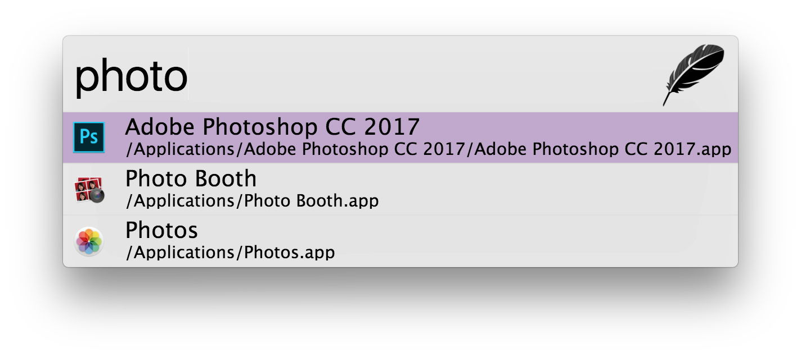

## Zazu

Zazu, is a cross platform and fully extensible and open source launcher for
hackers, creators and dabblers. Download it from the [releases
page](http://zazuapp.org/download).

Zazu was created to be a fully open source alternative to Alfred, but also be
completely plugin based. You can remove any functionality you don't like, so if
you hate the built in calculator, just get a new one!

We also have all of your configuration in a dotfile in `~/.zazurc.json` so it can
be backed up and synced!

Be sure to check out our amazing [Documentation](http://zazuapp.org).

## Action Shot

## Development

As you might expect:

~~~
npm install
npm start
~~~

If you enable debug mode it will make it so Zazu won't hide and the dev tools
will open by default. You can enable debug mode by adding a `debug` flag to
`true` inside of your `~/.zazurc.json`

~~~ javascript
{
  "debug": true,
  "hotkey": "cmd+space",
  "theme": "tinytacoteam/zazu-playful-theme",
  "plugins": []
}
~~~
